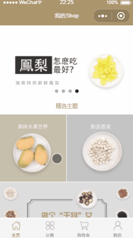

# 前言

该项目为用微信小程序端实现的电商平台类似淘宝店铺，项目使用 es6 类进行面向对象开发，封装公共模板，实现模块化开发，大大减少重复代码。

**注：项目不断完善中，请保持关注哟~**

## 技术栈

微信小程序

## 项目运行

#### 注意：小程序开发需要后台接口需要 https

```
git clone https://github.com/chenzeze/myShop-miniProgram.git

将项目使用微信web开发者工具打开

```

## 关于接口数据

此项目的所有接口数据都来源于配套的后台系统，[后台项目传送地址](待上传)。

如果想体验前后台同时开发，可以下载后台系统。

如果只做前端开发，请忽略上面这几句话哟～

# 说明

> 如果对您有帮助，您可以点右上角 "Star" 支持一下 谢谢！ ^\_^

> 开发环境 windows 10 Chrome 56

> 如有问题请直接在 Issues 中提，或者您发现问题并有非常好的解决方案，欢迎 PR 👍

# 效果演示



# 目标功能

- [x] 商品列表组件 -- 完成
- [x] 商品列表页 -- 完成
- [x] 下拉刷新，上拉加载更多商品 -- 待完成
- [x] 店铺主题页 -- 完成
- [x] 单个商品详情页面 -- 完成
- [x] 购物车功能 -- 完成
- [x] 购物车抛物线动画 -- 待完成
- [x] 商品分类页 -- 完成
- [x] 不同商品分类动画切换 -- 待完成
- [x] 已加载过的分类不再重复加载 -- 待完成
- [x] 商家详情页 -- 未完成
- [x] 小程序用户授权 -- 未完成
- [x] 个人中心 -- 待完成
- [x] 使用微信用户头像 -- 未完成
- [x] 下单功能 -- 待完成
- [x] 订单列表 -- 待完成
- [x] 订单详情 -- 待完成
- [x] 添加、删除、修改收货地址 -- 待完成
- [x] 付款 -- 待完成
